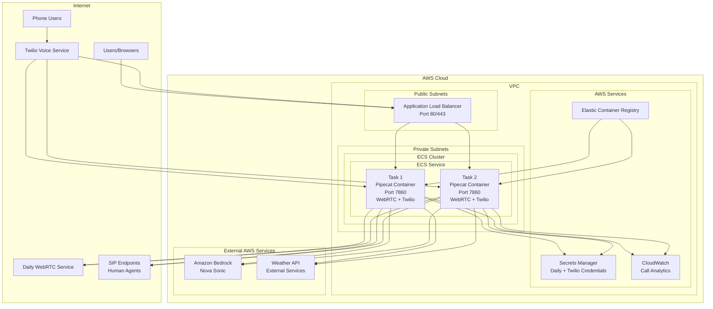

# Design Document

## Overview

This design outlines the deployment of the existing Pipecat-based voice AI agent to AWS ECS with Twilio phone integration capabilities. The solution will containerize the current local Python application and extend it with Twilio voice calling functionality, deploying both WebRTC and phone calling capabilities to AWS ECS. The goal is to create a comprehensive voice AI platform that supports both web-based Daily.co sessions and traditional phone calls through Twilio, all powered by the same Amazon Nova Sonic AI agent.

## Architecture

### High-Level Architecture



### User Access Flows

#### WebRTC Flow (Existing)

1. Users navigate to the ALB DNS name (e.g., `http://pipecat-alb-123456789.eu-north-1.elb.amazonaws.com`)
2. ALB routes traffic to one of the ECS tasks running the Pipecat container
3. The FastAPI server serves the existing client interface (same as `http://localhost:7860`)
4. Users interact with the same interface they would see locally
5. The backend creates Daily rooms and handles WebRTC connections as before

#### Twilio Phone Flow (New)

1. Users call the configured Twilio phone number
2. Twilio sends webhook to ALB endpoint `/incoming-call`
3. ALB routes webhook to available ECS task
4. ECS task returns TwiML response directing call to `/media-stream` WebSocket
5. Twilio establishes media stream connection to the same ECS task
6. Audio is processed bidirectionally through Nova Sonic
7. Function calls (weather queries) work through voice commands

### Container Architecture

The application will be containerized using the existing Dockerfile with minimal modifications:

- **Base Image**: Python 3.10 (as per existing Dockerfile)
- **Application**: Complete Pipecat application including FastAPI server and client interface
- **Port**: Expose port 7860 (same as local deployment)
- **Configuration**: Environment variables and secrets from AWS Secrets Manager

## Components and Interfaces

### 1. Container Image

**Purpose**: Packages the existing Pipecat application for ECS deployment
**Key Features**:

- Uses existing Dockerfile with minor security improvements
- Non-root user for security
- Health check endpoint for ECS monitoring
- Same functionality as local deployment

**Dockerfile Improvements**:

```dockerfile
FROM python:3.10-slim

# Create non-root user
RUN groupadd -r pipecat && useradd -r -g pipecat pipecat

# Set working directory
WORKDIR /app

# Copy requirements and install dependencies
COPY requirements.txt .
RUN pip install --no-cache-dir -r requirements.txt

# Copy application files
COPY *.py ./
COPY assets/ ./assets/ 2>/dev/null || true
COPY utils/ ./utils/ 2>/dev/null || true

# Change ownership to non-root user
RUN chown -R pipecat:pipecat /app
USER pipecat

# Health check
HEALTHCHECK --interval=30s --timeout=5s --start-period=60s --retries=3 \
  CMD curl -f http://localhost:7860/health || exit 1

EXPOSE 7860

CMD ["python", "server.py", "--host", "0.0.0.0", "--port", "7860"]
```

### 2. ECS Task Definition

**Purpose**: Defines how the Pipecat container should run
**Key Configuration**:

- CPU: 1 vCPU (1024 units)
- Memory: 2 GB (2048 MB)
- Network Mode: awsvpc
- Task Role: IAM role with Bedrock and Secrets Manager permissions

**Environment Variables**:

- `AWS_REGION`: Deployment region
- `HOST`: 0.0.0.0
- `FAST_API_PORT`: 7860

**Secrets** (from AWS Secrets Manager):

- `DAILY_API_KEY`: Daily.co API credentials
- `AWS_ACCESS_KEY_ID`: AWS credentials (optional if using IAM roles)
- `AWS_SECRET_ACCESS_KEY`: AWS credentials (optional if using IAM roles)

### 3. ECS Service

**Purpose**: Manages running tasks for testing
**Configuration**:

- Desired Count: 2 (for basic high availability)
- Max Healthy Percent: 200%
- Min Healthy Percent: 50%
- Health Check Grace Period: 60 seconds

**Auto Scaling**: Basic configuration

- Min Capacity: 1 task
- Max Capacity: 4 tasks
- Target CPU Utilization: 70%

### 4. Application Load Balancer

**Purpose**: Provides internet access to the ECS tasks
**Configuration**:

- Scheme: Internet-facing
- Listeners: HTTP (80) with optional HTTPS (443)
- Target Group: ECS tasks on port 7860
- Health Check: GET /health (to be added to FastAPI server)

### 5. Networking

**VPC Configuration**:

- Use default VPC or create simple VPC
- Public Subnets: 2 AZs for ALB
- Private Subnets: 2 AZs for ECS tasks
- NAT Gateway: For outbound internet access

**Security Groups**:

- ALB Security Group: Allow 80/443 from 0.0.0.0/0
- ECS Security Group: Allow 7860 from ALB Security Group
- Egress: Allow all outbound (for AWS services and Daily.co)

## Data Models

### 1. ECS Task Definition Schema

```json
{
  "family": "pipecat-voice-agent",
  "networkMode": "awsvpc",
  "requiresCompatibilities": ["FARGATE"],
  "cpu": "1024",
  "memory": "2048",
  "executionRoleArn": "arn:aws:iam::ACCOUNT:role/ecsTaskExecutionRole",
  "taskRoleArn": "arn:aws:iam::ACCOUNT:role/ecsTaskRole",
  "containerDefinitions": [
    {
      "name": "pipecat-container",
      "image": "ACCOUNT.dkr.ecr.REGION.amazonaws.com/pipecat-voice-agent:latest",
      "portMappings": [
        {
          "containerPort": 7860,
          "protocol": "tcp"
        }
      ],
      "environment": [
        {
          "name": "AWS_REGION",
          "value": "eu-north-1"
        },
        {
          "name": "HOST",
          "value": "0.0.0.0"
        },
        {
          "name": "FAST_API_PORT",
          "value": "7860"
        }
      ],
      "secrets": [
        {
          "name": "DAILY_API_KEY",
          "valueFrom": "arn:aws:secretsmanager:REGION:ACCOUNT:secret:pipecat/daily-api-key"
        }
      ],
      "logConfiguration": {
        "logDriver": "awslogs",
        "options": {
          "awslogs-group": "/ecs/pipecat-voice-agent",
          "awslogs-region": "eu-north-1",
          "awslogs-stream-prefix": "ecs"
        }
      }
    }
  ]
}
```

### 2. Simple Deployment Configuration

```python
@dataclass
class TestDeploymentConfig:
    environment: str = "test"
    aws_region: str = "eu-north-1"
    desired_count: int = 2
    max_capacity: int = 4
    min_capacity: int = 1
    use_default_vpc: bool = True
    enable_https: bool = False  # Optional for testing
```

## Error Handling

### 1. Health Check Implementation

Add a simple health check endpoint to the existing FastAPI server:

```python
@app.get("/health")
async def health_check():
    """Health check endpoint for ECS monitoring."""
    try:
        # Basic health check - ensure Daily helper is initialized
        daily_helper = daily_helpers.get("rest")
        if not daily_helper:
            raise HTTPException(status_code=503, detail="Daily API helper not initialized")

        return {"status": "healthy", "timestamp": datetime.utcnow().isoformat()}
    except Exception as e:
        logger.error(f"Health check failed: {e}")
        raise HTTPException(status_code=503, detail=f"Service unhealthy: {str(e)}")
```

### 2. Container Failure Recovery

- ECS automatically replaces failed tasks
- ALB health checks remove unhealthy targets
- CloudWatch logs for debugging

### 3. External Service Failures

- Existing error handling in the Pipecat application
- Retry logic for Daily API calls
- Proper error responses to users

## Testing Strategy

### 1. Local Container Testing

```bash
# Build and test container locally
docker build -t pipecat-voice-agent .
docker run -p 7860:7860 --env-file .env pipecat-voice-agent

# Test health endpoint
curl http://localhost:7860/health

# Test main application
open http://localhost:7860
```

### 2. ECS Deployment Testing

- Deploy to test environment
- Verify ALB health checks pass
- Test complete user flow through ALB DNS name
- Verify Daily WebRTC connections work
- Test Nova Sonic integration
- Validate function calling (weather API)

### 3. Load Testing

Basic load testing to ensure the containerized version handles multiple concurrent users:

- Multiple browser sessions
- Concurrent Daily room creation
- Resource utilization monitoring

### 4. Integration Testing

- End-to-end voice conversation testing
- Daily WebRTC connection validation
- AWS Bedrock Nova Sonic integration
- Function calling verification
- Log aggregation and monitoring

### 6. Twilio Integration Components

**Purpose**: Enable phone calling capabilities alongside existing WebRTC functionality

#### Twilio Webhook Endpoints

New FastAPI endpoints to handle Twilio integration:

```python
@app.post("/incoming-call")
async def handle_incoming_call(request: Request):
    """Handle incoming Twilio calls and return TwiML."""
    # Return TwiML to connect to media stream WebSocket

@app.websocket("/media-stream")
async def handle_media_stream(websocket: WebSocket):
    """Handle Twilio media stream WebSocket connection."""
    # Process bidirectional audio with Nova Sonic
    # Handle function calls (weather queries)
```

#### Twilio Configuration

**Environment Variables** (added to existing):

- `TWILIO_ACCOUNT_SID`: Twilio account identifier
- `TWILIO_API_SID`: Twilio API key SID
- `TWILIO_API_SECRET`: Twilio API key secret

**Secrets Manager Integration**:

```json
{
  "pipecat/twilio-credentials": {
    "account_sid": "ACxxxxx",
    "api_sid": "SKxxxxx",
    "api_secret": "xxxxx"
  }
}
```

#### Security Enhancements

**Webhook Signature Validation**:

```python
from twilio.request_validator import RequestValidator

def validate_twilio_request(request: Request, body: str) -> bool:
    """Validate Twilio webhook signature."""
    validator = RequestValidator(twilio_auth_token)
    signature = request.headers.get('X-Twilio-Signature', '')
    url = str(request.url)
    return validator.validate(url, body, signature)
```

**ALB Security Group Updates**:

- Allow inbound HTTPS (443) from Twilio IP ranges
- Maintain existing HTTP (80) for testing
- Keep port 7860 access from ALB only

### 7. Dual-Mode Operation

The enhanced application will support both communication modes simultaneously:

#### Shared Components

- Same Nova Sonic AI agent instance
- Shared function calling capabilities (weather API)
- Common logging and monitoring
- Unified error handling

#### Mode-Specific Handling

- **WebRTC Mode**: Daily.co room management, browser-based UI
- **Phone Mode**: Twilio media streams, TwiML responses, call state management

#### Resource Management

- Single container handles both modes
- Shared memory and CPU resources
- Connection pooling for external services
- Concurrent session handling

This enhanced design maintains the simplicity of the original ECS deployment while adding comprehensive phone calling capabilities through Twilio integration.
